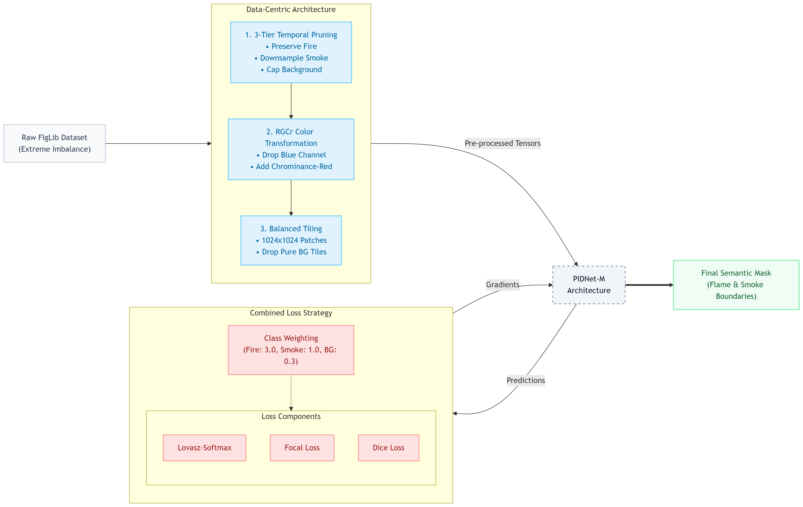

# Data-Centric Wildfire Detection via PIDNet

<div align="center">
  
  [](https://opensource.org/licenses/MIT)
  [](#)
  [](#)

  **Official PyTorch Implementation for the Paper:**  
  *"Combating Extreme Class Imbalance in Semantic Segmentation for Early Wildfire Detection"*
</div>

---

## 📖 Overview
Wildfire detection models trained on real-world datasets (like FIgLib) suffer from extreme class imbalances (e.g., 1:7 Flame-to-Smoke ratio), causing standard segmentation architectures to catastrophically fail at identifying critical minority classes. 

This repository provides a **data-centric pipeline** that rescues minority class performance. By pairing the highly efficient **PIDNet-M** architecture with a custom Lovasz-Focal-Dice Combined Loss, Temporal Pruning, RGCr Color Space isolation, and Balanced SAHI-Tiling, this pipeline pushes Fire mIoU from 62.1% to a state-of-the-art **81.1%**.

<div align="center">
  
</div>

---

## ✨ Key Contributions
1. **RGCr Color Transformation:** Drops the Blue channel and introduces Chrominance-Red to isolate thermal combustion signatures from diffuse background smoke.
2. **Balanced SAHI Tiling:** Forces the network to train on $1024 \times 1024$ high-resolution patches while deliberately dropping pure-background tiles to correct statistical bias.
3. **Combined Imbalance Loss:** A heavily weighted composite of Lovasz-Softmax, Focal Loss, and Dice Loss targeting gradient-level imbalance.

---

## 🛠️ Installation & Setup

**1. Clone the repository:**
```bash
git clone https://github.com/YourUsername/PIDNet-Wildfire-Segmentation.git
cd PIDNet-Wildfire-Segmentation
```

**2. Install dependencies:**
```bash
pip install -r requirements.txt
```

*Note: The core network architecture is adapted from the official [PIDNet repository](https://github.com/XuJian0106/PIDNet).*

---

## 🚀 Quick Start (Inference)

To run inference on a high-resolution image using the proposed RGCr + Tiling pipeline:

```bash
python generate_fig2.py --weights checkpoints/pidnet-fire-smokeNEWDATASETRGCrAT4REAL2-epoch=45-val_fire_smoke_iou=0.756.ckpt
```
This script handles the SAHI-style tiling, upsampling, and color conversion automatically using the utilities provided in `inference_utils.py`.

---

## 📊 Dataset Preparation (FIgLib)
Because this is a data-centric approach, dataset preparation is critical. 
1. Download the FIgLib dataset.
2. Run the temporal pruning script to extract 1 frame per minute during initial ignition.
3. Run the balanced tiling script to generate $1024 \times 1024$ patches.

*(Provide specific script commands here when ready)*

---

## 📈 Results

| Configuration | Color Space | Tiling | Loss | Fire mIoU | Smoke mIoU |
| :--- | :---: | :---: | :---: | :---: | :---: |
| Naive Baseline | RGB | None | CE | 62.08% | **80.68%** |
| Combined Loss | RGB | None | Combined | 79.93% | 79.88% |
| **Proposed Pipeline** | **RGCr** | **SAHI** | **Combined** | **81.05%** | 76.42% |

Our proposed pipeline trades a negligible amount of Smoke mIoU to achieve a massive **+19% absolute increase** in Fire mIoU, minimizing false positives while securing tightly bounded semantic masks for the active flame front.

---

## 📝 Citation
If you find this code or methodology useful in your research, please cite our paper:

```bibtex
@inproceedings{wildfire2026,
  title={Combating Extreme Class Imbalance in Semantic Segmentation for Early Wildfire Detection},
  author={First Last and First Last and ...},
  booktitle={2026 International Conference on Data Science and Its Applications (ICoDSA)},
  year={2026},
  organization={IEEE}
}
```

## 📄 License
This project is licensed under the MIT License - see the [LICENSE](LICENSE) file for details.
